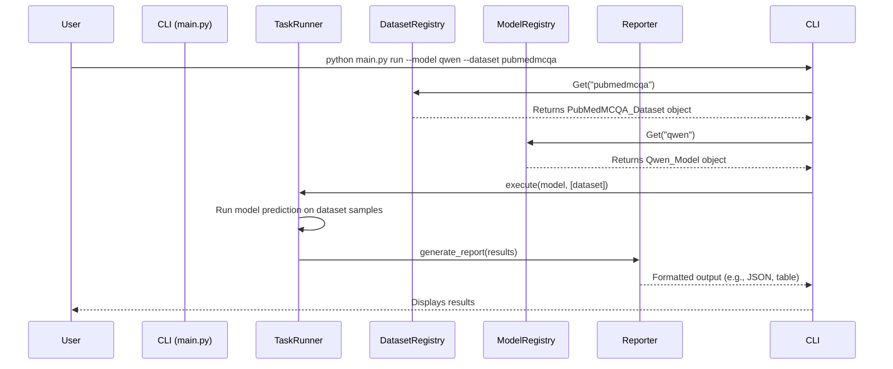
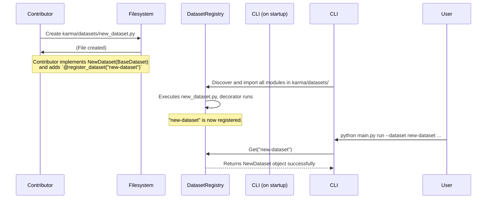

# Karma Benchmark Library: Architecture & Vision

This document outlines the proposed architecture for transforming the Karma library into a standard, extensible, and easy-to-use framework for evaluating AI models on healthcare benchmarks.

## 1. Guiding Principles

*   **Extensibility First:** The core design must make it trivial for contributors to add new datasets, models, and evaluation metrics without modifying the core library code.
*   **Ease of Use:** A clean, powerful Command Line Interface (CLI) will be the primary user interaction point. Running a benchmark should be a single, intuitive command.
*   **Reproducibility:** Evaluation runs should be configurable via files, allowing users to easily share and reproduce experiments.
*   **Modularity:** Components (data loaders, models, evaluators) must be decoupled, allowing them to be mixed and matched.

## 2. Proposed High-Level Architecture

The framework will be built around a few key components that are discovered and registered at runtime. This "plugin" style architecture is central to achieving our extensibility goal.


### Core Components:

1.  **CLI (main.py):** The user entry point, built using a modern CLI framework like `Typer`. It will parse user arguments, load configurations, and orchestrate the evaluation process.
2.  **Registry:** A central, in-memory store for all available `datasets`, `models`, and `tasks`. Components automatically register themselves upon import, making them available to the CLI.
3.  **`BaseDataset` (Abstract Class):** A contract for all datasets. A contributor adds a new dataset by subclassing `BaseDataset` and implementing methods like `load_data()` and `preprocess()`. The class is then automatically registered.
4.  **`BaseModel` (Abstract Class):** A contract for all models. To add a new model (e.g., a new API, a different open-source family), a contributor subclasses `BaseModel` and implements a `predict()` method.
5.  **`TaskRunner`:** The engine that takes a registered model and a list of registered datasets, runs the model's predictions on the data, and gathers the results.
6.  **`MetricsCalculator`:** Computes metrics (e.g., Accuracy, F1, BLEU, MedMCQA Score) on the predictions. This will also be extensible.
7.  **`Reporter`:** Formats and outputs the results in various formats (e.g., console table, JSON, CSV, Markdown).

---

## 3. Sequence Diagrams

### A. Standard Evaluation Flow

This diagram shows the sequence of events when a user runs an evaluation.



### B. Extensibility: Adding a New Dataset

This diagram shows how a contributor can easily add a new dataset.



---

## 4. Configuration-Driven Evaluation

While CLI arguments are good for simple runs, complex evaluations should be defined in a YAML file for clarity and reproducibility.

**Example `evaluation.yaml`:**

```yaml
# A single evaluation run
run_id: "qwen-multitask-eval-06-27-2025"
model:
  name: "qwen" # Registered model name
  args:
    model_path: "Qwen/Qwen1.5-7B-Chat"
    precision: "bf16"
datasets:
  - "pubmedmcqa"
  - "medmcqa"
  - "vqa_rad"
output:
  format: "json" # or "csv", "markdown"
  path: "./results/qwen_eval.json"
```

The CLI would be simplified to: `python main.py run --config evaluation.yaml`

---

## 5. Pragmatic 1-Week Plan

This plan focuses on building a minimum viable version of the new architecture.

**Goal:** Be able to run one registered model on one or more registered datasets and see the results printed to the console.

*   **Day 1: Scaffolding & Core Interfaces**
    *   [ ] Introduce `typer` for CLI argument parsing in `main.py`.
    *   [ ] Create a skeleton `run` command: `python main.py run --model <model_name> --dataset <dataset_name>`.
    *   [ ] Define the abstract base classes in `karma/models/base.py` and `karma/eval_datasets/base_dataset.py`.
        *   `BaseModel` with an abstract `predict(self, prompts: list[str]) -> list[str]` method.
        *   `BaseDataset` with an abstract `load_data(self) -> pd.DataFrame` method.

*   **Day 2: Registry & Discovery**
    *   [ ] Implement a simple dictionary-based `Registry` for models and datasets.
    *   [ ] Create decorators (`@register_model`, `@register_dataset`) that add the class to the registry upon import.
    *   [ ] Write logic in the `karma/__init__.py` or the CLI to automatically import all modules from `karma/models` and `karma/eval_datasets` to trigger the registration.

*   **Day 3: Integrate First Dataset & Model**
    *   [ ] Refactor `PubMedMCQADataset` to inherit from `BaseDataset` and use the `@register_dataset("pubmedmcqa")` decorator.
    *   [ ] Refactor the Qwen model logic into a `QwenModel` class that inherits from `BaseModel` and uses `@register_model("qwen")`. Keep it simple: load from Hugging Face.

*   **Day 4: Implement the `TaskRunner`**
    *   [ ] Create `karma/tasks/runner.py`.
    *   [ ] The runner will take a model object and a list of dataset objects.
    *   [ ] For each dataset, it will:
        1.  Call `dataset.load_data()`.
        2.  Construct prompts.
        3.  Call `model.predict()` with the prompts.
        4.  Store the results (prompt, prediction, ground_truth).

*   **Day 5: Basic Metrics & Reporting**
    *   [ ] Create a simple `calculate_accuracy` function.
    *   [ ] The `TaskRunner` will call this function after getting predictions.
    *   [ ] Create a basic `Reporter` that takes the final results and prints a clean summary table to the console.
    *   [ ] Hook everything together in the `main.py` `run` command.

*   **Day 6-7: Testing, Refinement & Documentation**
    *   [ ] Test the end-to-end flow: `python main.py run --model qwen --dataset pubmedmcqa`.
    *   [ ] Add the ability to pass multiple datasets: `--dataset pubmedmcqa --dataset medmcqa`.
    *   [ ] Write a `README.md` explaining how to use the new CLI and how to add a new model or dataset.
    *   [ ] Clean up code and add comments.
