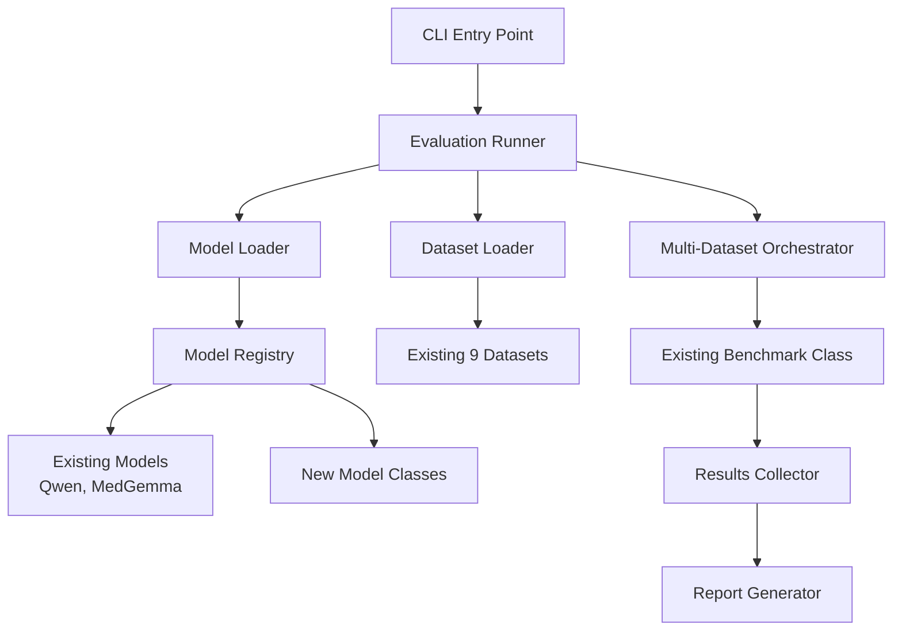

# Healthcare Benchmark Library - Pragmatic Architecture

## Overview

This document outlines a pragmatic, implementable architecture that builds upon the existing codebase structure. The design focuses on immediate usability while providing essential extensibility for new models and comprehensive multi-dataset evaluation.

## Design Philosophy

1. **Build on Existing Foundation**: Leverage current `Benchmark`, `BaseLLM`, and dataset classes
2. **Minimal Changes**: Extend rather than rewrite existing components
3. **CLI-First but Simple**: Straightforward command interface without complex configuration
4. **Quick Implementation**: Achievable in 2-3 days of development
5. **Multi-Dataset Focus**: Single model evaluated across multiple datasets and metrics

## Current State Analysis

### Existing Components (Leverage These)
- ✅ `Benchmark` class - Core evaluation engine
- ✅ `BaseLLM` - Model abstraction with multimodal support
- ✅ `BaseMultimodalDataset` - Dataset interface
- ✅ 9 healthcare datasets already implemented
- ✅ Cache management system
- ✅ Weave integration for tracking

### Missing Components (Need to Add)
- ❌ CLI interface
- ❌ Model registry/discovery
- ❌ Multi-dataset evaluation orchestrator
- ❌ Results aggregation and reporting

## Simplified Architecture



## CLI Interface Design

### Simple Command Structure
```bash
# Basic evaluation - single model, all datasets
karma eval --model qwen --model-path "Qwen/Qwen2.5-0.5B-Instruct"

# Specify datasets
karma eval --model qwen --model-path "Qwen/Qwen2.5-0.5B-Instruct" --datasets pubmedqa,medmcqa

# With custom parameters
karma eval --model qwen --model-path "Qwen/Qwen2.5-0.5B-Instruct" --batch-size 16 --cache-path ./cache

# List available models and datasets
karma list models
karma list datasets

# Add new model
karma add-model --name my-model --class MyModelClass --file path/to/model.py
```

### Implementation Plan

#### 1. CLI Entry Point (Day 1 - 2 hours)

```python
# main.py (replace existing)
import argparse
import sys
from karma.cli import CLIRunner

def main():
    parser = argparse.ArgumentParser(description='Healthcare AI Model Evaluation')
    subparsers = parser.add_subparsers(dest='command', help='Available commands')
    
    # Eval command
    eval_parser = subparsers.add_parser('eval', help='Evaluate model')
    eval_parser.add_argument('--model', required=True, help='Model name')
    eval_parser.add_argument('--model-path', required=True, help='Model path/ID')
    eval_parser.add_argument('--datasets', help='Comma-separated dataset names (default: all)')
    eval_parser.add_argument('--batch-size', type=int, default=8, help='Batch size')
    eval_parser.add_argument('--cache-path', default='./cache.db', help='Cache database path')
    eval_parser.add_argument('--output', default='results.json', help='Output file')
    
    # List command
    list_parser = subparsers.add_parser('list', help='List models or datasets')
    list_parser.add_argument('type', choices=['models', 'datasets'], help='What to list')
    
    
    args = parser.parse_args()
    
    if not args.command:
        parser.print_help()
        sys.exit(1)
    
    runner = CLIRunner()
    runner.execute(args)

if __name__ == "__main__":
    main()
```

#### 2. Decorator-Based Model Registry (Day 1 - 3 hours)

```python
# karma/registry.py
import importlib
import pkgutil
from typing import Dict, Type, List, Callable
from karma.models.base import BaseLLM

class ModelRegistry:
    """Decorator-based model registry for automatic model discovery."""
    
    def __init__(self):
        self.models: Dict[str, Type[BaseLLM]] = {}
    
    def register_model(self, name: str):
        """Decorator to register a model class."""
        def decorator(model_class: Type[BaseLLM]) -> Type[BaseLLM]:
            if not issubclass(model_class, BaseLLM):
                raise ValueError(f"{model_class.__name__} must inherit from BaseLLM")
            
            self.models[name] = model_class
            print(f"Registered model: {name} -> {model_class.__name__}")  # Debug info
            return model_class
        return decorator
    
    def get_model(self, name: str) -> Type[BaseLLM]:
        """Get model class by name."""
        if name not in self.models:
            raise ValueError(f"Model '{name}' not found. Available: {list(self.models.keys())}")
        return self.models[name]
    
    def list_models(self) -> List[str]:
        """List available model names."""
        return list(self.models.keys())
    
    def discover_models(self):
        """Automatically discover and import all model modules."""
        import karma.models
        
        # Import all modules in karma.models package
        for finder, name, ispkg in pkgutil.iter_modules(karma.models.__path__, karma.models.__name__ + "."):
            if not name.endswith('.base'):  # Skip base module
                try:
                    importlib.import_module(name)
                except ImportError as e:
                    print(f"Warning: Could not import {name}: {e}")

# Global registry instance
model_registry = ModelRegistry()

# Convenience decorator function
register_model = model_registry.register_model
```

#### 3. Decorator-Based Dataset Registry (Day 1 - 2 hours)

```python
# karma/dataset_registry.py
import importlib
import pkgutil
from typing import Dict, Type, List
from karma.eval_datasets.base_dataset import BaseMultimodalDataset

class DatasetRegistry:
    """Decorator-based registry for datasets with their metrics."""
    
    def __init__(self):
        self.datasets: Dict[str, dict] = {}
    
    def register_dataset(self, name: str, metrics: List[str], task_type: str = "mcqa"):
        """Decorator to register a dataset class with its metrics."""
        def decorator(dataset_class: Type[BaseMultimodalDataset]) -> Type[BaseMultimodalDataset]:
            if not issubclass(dataset_class, BaseMultimodalDataset):
                raise ValueError(f"{dataset_class.__name__} must inherit from BaseMultimodalDataset")
            
            self.datasets[name] = {
                'class': dataset_class,
                'metrics': metrics,
                'task_type': task_type
            }
            print(f"Registered dataset: {name} -> {dataset_class.__name__}")  # Debug info
            return dataset_class
        return decorator
    
    def get_dataset_info(self, name: str) -> dict:
        """Get dataset information."""
        if name not in self.datasets:
            raise ValueError(f"Dataset '{name}' not found. Available: {list(self.datasets.keys())}")
        return self.datasets[name]
    
    def list_datasets(self) -> List[str]:
        """List available dataset names."""
        return list(self.datasets.keys())
    
    def create_dataset(self, name: str, **kwargs) -> BaseMultimodalDataset:
        """Create dataset instance."""
        info = self.get_dataset_info(name)
        return info['class'](**kwargs)
    
    def discover_datasets(self):
        """Automatically discover and import all dataset modules."""
        import karma.eval_datasets
        
        # Import all modules in karma.eval_datasets package
        for finder, name, ispkg in pkgutil.iter_modules(karma.eval_datasets.__path__, karma.eval_datasets.__name__ + "."):
            if not name.endswith('.base_dataset'):  # Skip base module
                try:
                    importlib.import_module(name)
                except ImportError as e:
                    print(f"Warning: Could not import {name}: {e}")

# Global registry instance
dataset_registry = DatasetRegistry()

# Convenience decorator function
register_dataset = dataset_registry.register_dataset
```

#### 4. Multi-Dataset Orchestrator (Day 2 - 4 hours)

```python
# karma/orchestrator.py
import json
import time
from typing import List, Dict, Any
from karma.benchmark import Benchmark
from karma.registry import model_registry
from karma.dataset_registry import dataset_registry

class MultiDatasetOrchestrator:
    """Orchestrates evaluation across multiple datasets for a single model."""
    
    def __init__(self, model_name: str, model_path: str, **model_kwargs):
        """Initialize with model configuration."""
        self.model_name = model_name
        self.model_path = model_path
        self.model_kwargs = model_kwargs
        self.results = {}
    
    def evaluate_all_datasets(self, 
                            dataset_names: List[str] = None,
                            batch_size: int = 8,
                            cache_path: str = "./cache.db") -> Dict[str, Any]:
        """Evaluate model on multiple datasets."""
        
        if dataset_names is None:
            dataset_names = dataset_registry.list_datasets()
        
        # Discover all models and datasets first
        model_registry.discover_models()
        dataset_registry.discover_datasets()
        
        # Initialize model once
        model_class = model_registry.get_model(self.model_name)
        model = model_class(self.model_path, **self.model_kwargs)
        
        overall_start_time = time.time()
        
        for dataset_name in dataset_names:
            print(f"\n{'='*50}")
            print(f"Evaluating on {dataset_name.upper()}")
            print(f"{'='*50}")
            
            try:
                # Create dataset
                dataset_info = dataset_registry.get_dataset_info(dataset_name)
                dataset = dataset_registry.create_dataset(
                    dataset_name, 
                    dataset_name=dataset_name,
                    split='test'
                )
                
                # Run evaluation for each metric
                dataset_results = {}
                for metric_name in dataset_info['metrics']:
                    print(f"\nComputing {metric_name}...")
                    
                    # Create benchmark instance
                    benchmark = Benchmark(
                        model=model,
                        dataset=dataset,
                        enable_cache=True,
                        cache_path=cache_path
                    )
                    
                    # Configure metric
                    metric_config = {
                        'metric': metric_name,
                        'processors': []  # Add processors if needed
                    }
                    
                    # Run evaluation
                    result = benchmark.evaluate(
                        metric_config=metric_config,
                        batch_size=batch_size
                    )
                    
                    dataset_results[metric_name] = {
                        'score': result['overall_score'],
                        'evaluation_time': result['summary']['evaluation_time'],
                        'num_samples': len(result['predictions'])
                    }
                    
                    print(f"{metric_name}: {result['overall_score']:.3f}")
                
                self.results[dataset_name] = {
                    'metrics': dataset_results,
                    'task_type': dataset_info['task_type'],
                    'status': 'completed'
                }
                
            except Exception as e:
                print(f"Error evaluating {dataset_name}: {str(e)}")
                self.results[dataset_name] = {
                    'error': str(e),
                    'status': 'failed'
                }
        
        # Add summary
        total_time = time.time() - overall_start_time
        self.results['_summary'] = {
            'model': self.model_name,
            'model_path': self.model_path,
            'total_datasets': len(dataset_names),
            'successful_datasets': len([r for r in self.results.values() 
                                      if isinstance(r, dict) and r.get('status') == 'completed']),
            'total_evaluation_time': total_time,
            'timestamp': time.strftime('%Y-%m-%d %H:%M:%S')
        }
        
        return self.results
    
    def save_results(self, output_path: str):
        """Save results to JSON file."""
        with open(output_path, 'w') as f:
            json.dump(self.results, f, indent=2)
        print(f"\nResults saved to {output_path}")
    
    def print_summary(self):
        """Print evaluation summary."""
        summary = self.results.get('_summary', {})
        
        print(f"\n{'='*60}")
        print(f"EVALUATION SUMMARY")
        print(f"{'='*60}")
        print(f"Model: {summary.get('model', 'Unknown')}")
        print(f"Model Path: {summary.get('model_path', 'Unknown')}")
        print(f"Total Time: {summary.get('total_evaluation_time', 0):.2f}s")
        print(f"Datasets: {summary.get('successful_datasets', 0)}/{summary.get('total_datasets', 0)} successful")
        
        print(f"\nPER-DATASET RESULTS:")
        print(f"{'-'*60}")
        
        for dataset, result in self.results.items():
            if dataset.startswith('_'):
                continue
                
            if result.get('status') == 'completed':
                print(f"\n{dataset.upper()}:")
                for metric, data in result['metrics'].items():
                    print(f"  {metric}: {data['score']:.3f} ({data['num_samples']} samples)")
            else:
                print(f"\n{dataset.upper()}: FAILED - {result.get('error', 'Unknown error')}")
```

#### 5. CLI Runner (Day 2 - 3 hours)

```python
# karma/cli.py
from karma.orchestrator import MultiDatasetOrchestrator
from karma.registry import model_registry
from karma.dataset_registry import dataset_registry

class CLIRunner:
    """Main CLI execution logic."""
    
    def execute(self, args):
        """Execute CLI command."""
        if args.command == 'eval':
            self._run_evaluation(args)
        elif args.command == 'list':
            self._list_items(args)
    
    def _run_evaluation(self, args):
        """Run model evaluation."""
        print(f"Starting evaluation with model: {args.model}")
        print(f"Model path: {args.model_path}")
        
        # Parse datasets
        if args.datasets:
            dataset_names = [d.strip() for d in args.datasets.split(',')]
        else:
            dataset_names = None  # Use all datasets
        
        # Create orchestrator
        orchestrator = MultiDatasetOrchestrator(
            model_name=args.model,
            model_path=args.model_path
        )
        
        # Run evaluation
        results = orchestrator.evaluate_all_datasets(
            dataset_names=dataset_names,
            batch_size=args.batch_size,
            cache_path=args.cache_path
        )
        
        # Print and save results
        orchestrator.print_summary()
        orchestrator.save_results(args.output)
    
    def _list_items(self, args):
        """List models or datasets."""
        if args.type == 'models':
            models = model_registry.list_models()
            print("Available models:")
            for model in models:
                print(f"  - {model}")
        elif args.type == 'datasets':
            datasets = dataset_registry.list_datasets()
            print("Available datasets:")
            for dataset in datasets:
                info = dataset_registry.get_dataset_info(dataset)
                metrics = ', '.join(info['metrics'])
                print(f"  - {dataset} ({info['task_type']}) - metrics: {metrics}")
    
```

## Updating Existing Components

### Existing Models with Decorators
```python
# karma/models/qwen.py
from karma.models.base import BaseLLM
from karma.registry import register_model

@register_model("qwen")
class QwenModel(BaseLLM):
    # Existing implementation stays the same
    pass

# karma/models/medgemma.py
from karma.models.base import BaseLLM  
from karma.registry import register_model

@register_model("medgemma")
class MedGemmaModel(BaseLLM):
    # Existing implementation stays the same
    pass
```

### Existing Datasets with Decorators
```python
# karma/eval_datasets/pubmedmcqa_dataset.py
from karma.eval_datasets.base_dataset import BaseMultimodalDataset
from karma.dataset_registry import register_dataset

@register_dataset("pubmedqa", metrics=["accuracy"], task_type="mcqa")
class PubMedQADataset(BaseMultimodalDataset):
    # Existing implementation stays the same
    pass

# karma/eval_datasets/slake_dataset.py
from karma.eval_datasets.base_dataset import BaseMultimodalDataset
from karma.dataset_registry import register_dataset

@register_dataset("slake", metrics=["accuracy", "bleu"], task_type="vqa")
class SLAKEDataset(BaseMultimodalDataset):
    # Existing implementation stays the same
    pass
```

## Usage Examples

### Basic Evaluation
```bash
# Evaluate Qwen model on all datasets
karma eval --model qwen --model-path "Qwen/Qwen2.5-0.5B-Instruct"

# Output:
# ==================================================
# Evaluating on PUBMEDQA
# ==================================================
# Computing accuracy...
# accuracy: 0.756
# 
# ==================================================
# Evaluating on MEDMCQA  
# ==================================================
# Computing accuracy...
# accuracy: 0.643
# ...
```

### Selective Dataset Evaluation
```bash
# Evaluate only on specific datasets
karma eval --model qwen --model-path "Qwen/Qwen2.5-0.5B-Instruct" --datasets pubmedqa,medmcqa,slake
```

### Adding Custom Model
```python
# my_custom_model.py
from karma.models.base import BaseLLM
from karma.registry import register_model

@register_model("my-llm")
class MyCustomLLM(BaseLLM):
    def format_inputs(self, prompts, images=None, audios=None):
        # Your implementation
        pass
    
    def format_outputs(self, outputs):
        # Your implementation
        pass

# Just place this file in karma/models/ directory
```

```bash
# Now use it directly:
karma eval --model my-llm --model-path "path/to/model"
```

## Expected Output Format

```json
{
  "pubmedqa": {
    "metrics": {
      "accuracy": {
        "score": 0.756,
        "evaluation_time": 45.2,
        "num_samples": 1000
      }
    },
    "task_type": "mcqa",
    "status": "completed"
  },
  "medmcqa": {
    "metrics": {
      "accuracy": {
        "score": 0.643,
        "evaluation_time": 38.7,
        "num_samples": 4183
      }
    },
    "task_type": "mcqa", 
    "status": "completed"
  },
  "_summary": {
    "model": "qwen",
    "model_path": "Qwen/Qwen2.5-0.5B-Instruct",
    "total_datasets": 8,
    "successful_datasets": 8,
    "total_evaluation_time": 342.1,
    "timestamp": "2024-12-27 15:30:45"
  }
}
```

## Implementation Timeline

### Day 1 (4-5 hours)
- ✅ Create CLI entry point (`main.py`)
- ✅ Implement Model Registry (`karma/registry.py`)
- ✅ Implement Dataset Registry (`karma/dataset_registry.py`)
- ✅ Basic CLI command parsing

### Day 2 (4-5 hours)  
- ✅ Implement Multi-Dataset Orchestrator (`karma/orchestrator.py`)
- ✅ Implement CLI Runner (`karma/cli.py`)
- ✅ Integration and testing
- ✅ Documentation and examples

### Day 3 (2-3 hours)
- ✅ Bug fixes and polish
- ✅ Add error handling
- ✅ Performance optimizations
- ✅ Final testing

## Extension Points for Future

### Adding New Models
Users can add models by:
1. Creating a class that inherits from `BaseLLM`
2. Adding `@register_model("model-name")` decorator
3. Placing file in `karma/models/` directory

### Adding New Datasets
Contributors can add datasets by:
1. Creating a class that inherits from `BaseMultimodalDataset`
2. Adding `@register_dataset("dataset-name", metrics=["accuracy"], task_type="mcqa")` decorator
3. Placing file in `karma/eval_datasets/` directory

### Adding New Metrics
New metrics can be added by extending the metrics configuration in dataset registry.

## Benefits of Decorator-Based Approach

1. **Quick Implementation**: Builds on existing solid foundation
2. **Immediate Value**: Works with current datasets and models
3. **Zero-Configuration Extension**: Just add a decorator and place file in directory
4. **Auto-Discovery**: No manual registration needed - decorators handle everything
5. **Clean Code**: Decorators make intent clear and keep registration logic separate
6. **Multi-Dataset Focus**: Addresses core requirement of evaluating across multiple datasets
7. **Practical CLI**: Simple, intuitive command interface
8. **Minimal Configuration**: No complex YAML files required
9. **Backward Compatible**: Doesn't break existing notebook-based workflows
10. **Contributor Friendly**: Adding new components is as simple as `@register_model("name")`

### Why Decorators Are Perfect Here

1. **Automatic Registration**: Components register themselves when imported
2. **Clear Intent**: The decorator makes it obvious what a class is for
3. **Metadata Co-location**: Metrics and task types are defined with the dataset
4. **No Manual Steps**: Contributors don't need to remember to update registry files
5. **IDE Friendly**: Decorators are well-supported by IDEs for navigation and refactoring

This architecture provides immediate value while maintaining the flexibility to evolve into a more sophisticated system as needs grow.