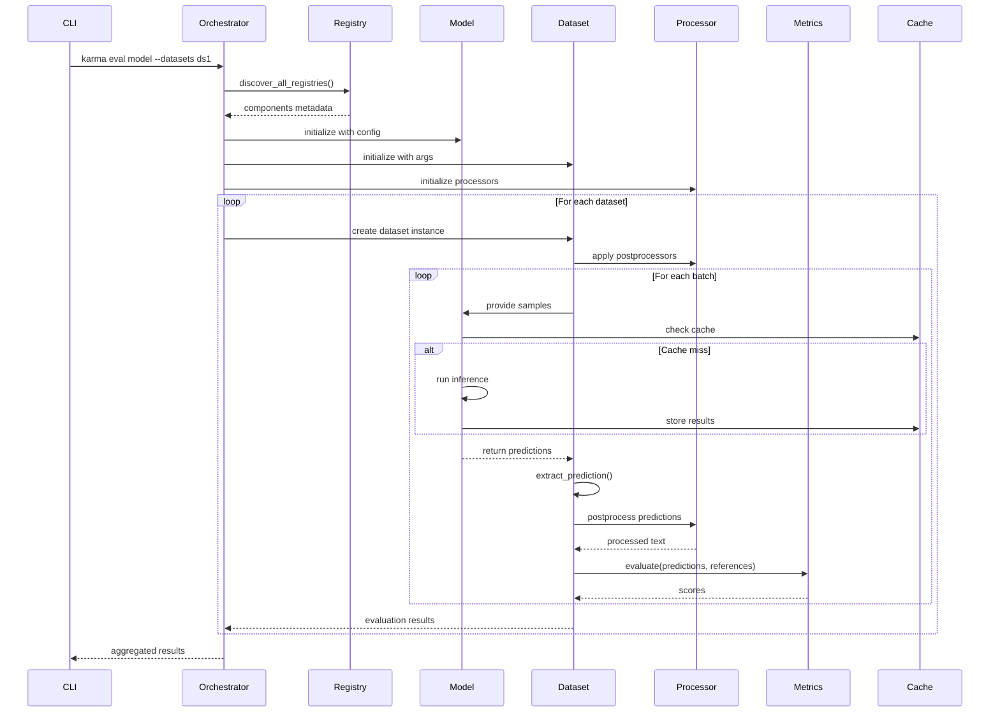
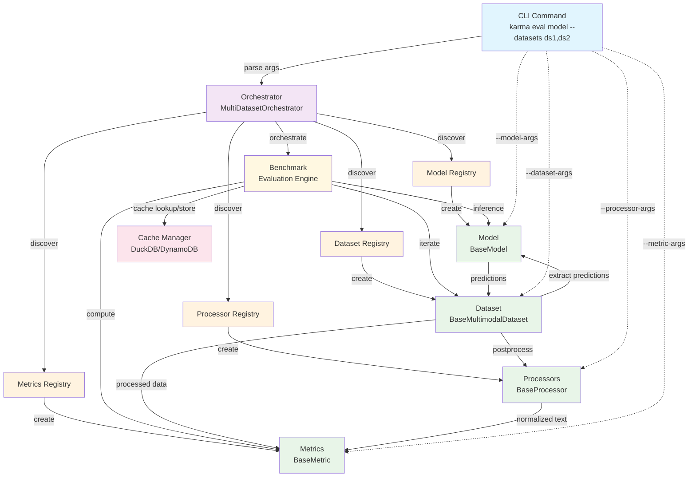

This document defines the four core components of KARMA's evaluation system and how they interact with each other.
1. Models
2. Datasets
3. Metrics
4. Processors

## Data Flow Sequence

## Component Interaction Diagram

This architecture ensures clean separation of concerns while enabling flexible configuration and robust error handling throughout the evaluation process.
