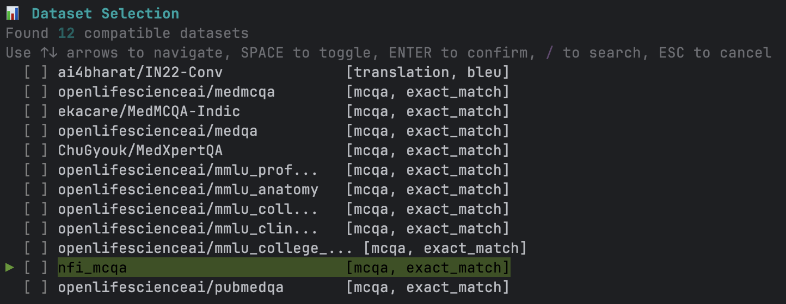

# Interactive Mode User Guide

KARMA's **Interactive Mode** provides a guided, beginner-friendly, and terminal-based experience for benchmarking language and speech models. This mode walks you through choosing a model, configuring arguments, selecting datasets, reviewing a summary, and executing the evaluation—all without needing custom scripts.

---

## 1. Launch Interactive Mode

Open your terminal in the root folder of your KARMA project and run:

```python
karma interactive
```


This starts the interactive workflow. You will see a welcome screen indicating that the system is ready.


---

## 2. Choose a Model

You'll be shown a list of available models that fit your selected mode. Navigate using the arrow keys and press Enter to select.


---
## 3. Configure Model Arguments (Optional)

Some models accept additional parameters, like `temperature` or `max_tokens`. If prompted, you can:

- Enter custom values for the arguments.
- Skip this step to use each argument's default value.


---

## 4. Select a Dataset

Choose one or more datasets against which you want to evaluate the model. Press Space to select and Enter to confirm. You can also filter datasets using the provided search option.



---

## 6. Review Configuration Summary

Before continuing, you’ll be shown an **overall summary** of the configuration:

- Selected model and its arguments
- Chosen dataset(s)

Review to ensure all selections are correct.


---

## 7. Save and Execute Evaluation

You’ll be asked if you want to:

- **Save this configuration** for future use
- **Execute the evaluation now**

Choose the appropriate option based on your preference.


---

## 8. View Results

Once the evaluation begins, progress is displayed live in the terminal. When it’s complete, the output (metrics/results) will be shown on screen for review.

