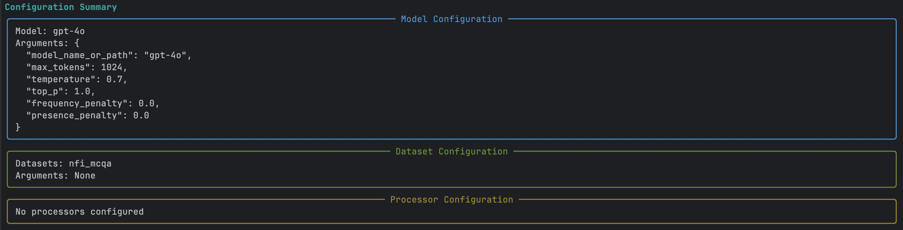

KARMA's **Interactive Mode** provides a terminal-based experience for benchmarking language and speech models. 

This mode walks you through choosing a model, configuring arguments, selecting datasets, reviewing a summary, and executing the evaluations.

---

## 1. Launch Interactive Mode

Open your terminal in the root folder of your KARMA project and run:

```python
karma interactive
```


This starts the interactive workflow. 

You will see a welcome screen indicating that the system is ready.


---

## 2. Choose a Model

Next, you’ll get a list of available models. 

Use the arrow keys to scroll through and hit Enter to select the one you want.


---
## 3. Configure Model Arguments (Optional)

Some models let you tweak parameters like `temperature` or `max_tokens`. If that’s the case, you’ll be prompted to either:

- Enter your own values  
- Or press Enter to skip


---

## 4. Select a Dataset

Choose datasets against which you want to evaluate the model. 
- Press `Space` to select one or more datasets  
- Hit `Enter` to confirm your selection  
- Use the `/` to search for specific datasets


---

## 5. Review Configuration Summary

Before continuing, you’ll be shown an **overall summary** of the configuration:

- Selected model and its arguments
- Chosen dataset(s)

Make sure everything looks right before continuing.



---

## 6. Save and Execute Evaluation

You’ll be asked if you want to:

- Save this configuration for later  
- Run the evaluation now or later

Choose whatever works best for your workflow..


---

## 7. View Results

Once the evaluation begins, you’ll see real-time progress in your terminal. 

When it’s finished, the results will be displayed right away for you to review.


---